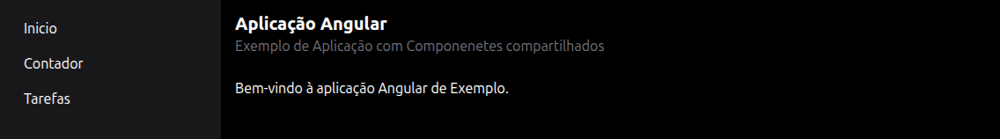
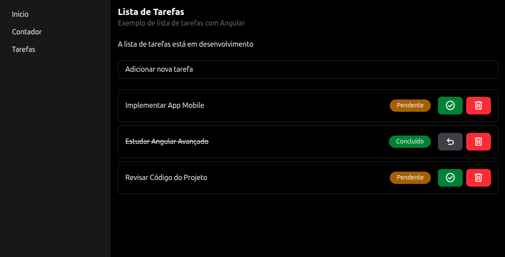
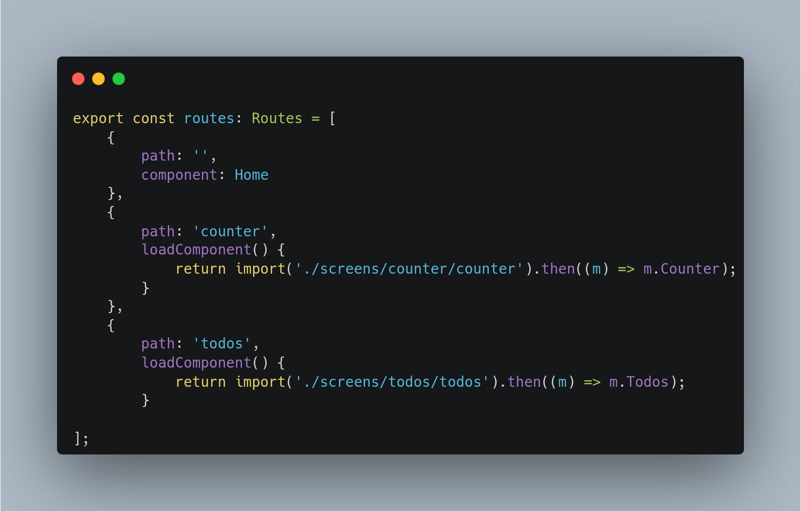
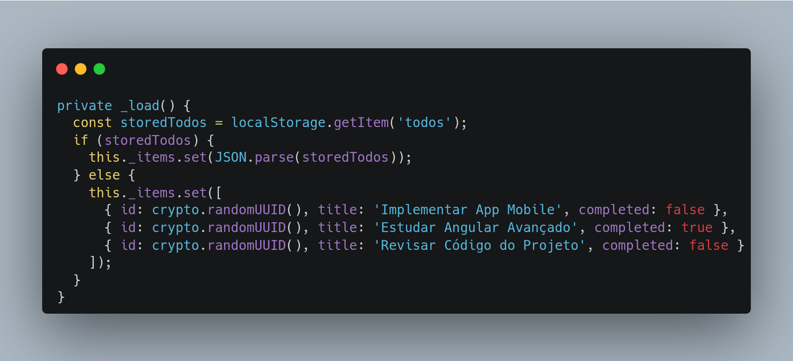

# Aprendendo Angular

Esse projeto foi criado com a função de aprender [angular](https://angular.dev/installation).

Nesse projeto a [documentação do angular](https://angular.dev) está na [versão 20](https://angular.dev/installation).

## Demonstração



## Screenshots




## Variáveis de Ambiente

Para rodar esse projeto, você vai precisar adicionar as seguintes variáveis de ambiente no seu .env

`NOTION_KEY`

`DATABASE_ID`

`GOOGLE_KEY`

`CHANNEL_ID`


## Rodando localmente

Clone o projeto

```bash
  git clone https://github.com/danilo-righetto/learning-angular
```

Entre no diretório do projeto

```bash
  cd learning-angular
```

Instale o Angular CLI

```bash
  npm install -g @angular/cli
```

Instale as dependências

```bash
  npm install
  # node version v22.21.0
```

Inicie o servidor

```bash
  ng serve
```

Após isso acesse o projeto: [http://localhost:4200](http://localhost:4200/).

## Instalação

Execute o comando para realizar a instalação do projeto:

```bash
  npm install
```

**Observação**: utilize a versão [v22.21.0](https://nodejs.org/pt) do Node.
    
## Deploy

Para fazer o deploy desse projeto rode o seguinte comando:

```bash
  ng build
```


## Documentação

As rotas são carregadas com "**Lazy Load**":



Os itens das tarefas são armazenados **localmente**:




## Autores

- [@danilorighetto](https://www.linkedin.com/in/danilo-righetto/)


## Referência

 - [Angular 20 em 1 HORA | Versão 2025](https://www.youtube.com/watch?v=_dh6dpaiTrY)

## Licença

[GNU Affero v3.0](https://choosealicense.com/licenses/agpl-3.0/)